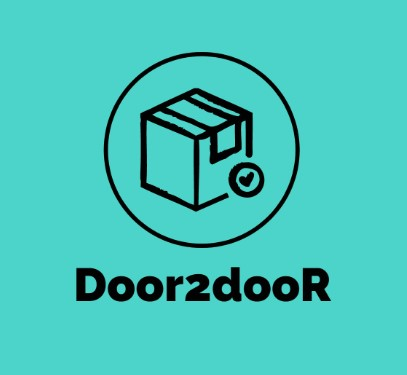

# Door2dooR

<div id="top"></div>

<!-- PROJECT LOGO -->
<br />
<div align="center">
  <a href="https://github.com/mrpirated/Door2dooR">
    
  </a>

  <h3 align="center">Door2dooR</h3>

  <p align="center">
    We provide the best route for your parcel according to your needs
    <br />
    <a href="https://github.com/mrpirated/Door2dooR"><strong>Explore the docs »</strong></a>
    <br />
    <br />
    <a href="https://github.com/mrpirated/Door2dooR">View Demo</a>
    ·
    <a href="https://github.com/mrpirated/Door2dooR/issues">Report Bug</a>
    ·
    <a href="https://github.com/mrpirated/Door2dooR/issues">Request Feature</a>
  </p>
</div>

<!-- TABLE OF CONTENTS -->
<details>
  <summary>Table of Contents</summary>
  <ol>
    <li>
      <a href="#about-the-project">Problem Statement</a>
      <ul>
      <li><a href="#problems-with-current-logistic-management">Problems with current logistic management</a></li>
      <li><a href="#proposed-solution">Proposed Solution</a></li>
        <li><a href="#built-with">Built With</a></li>
      </ul>
    </li>
    <li>
      <a href="#getting-started">Getting Started</a>
      <ul>
        <li><a href="#prerequisites">Prerequisites</a></li>
        <li><a href="#installation">Installation</a></li>
      </ul>
    </li>
    <li>
      <a href="#demo-video">Demo Video</a>
    </li>
    <li>
         <a href="#presentation-link">Presentation Link</a>
    </li>
      
  </ol>
</details>

<!-- ABOUT THE PROJECT -->

## Problem Statement

### Problems with current logistic management

- The sad truth of the scenario is that a package stays put at just one place for longer than moving.
- Unhappy customers: A customer is less likely to buy from a merchant who cannot keep to the promised delivery time. Thus reduces Customer Lifetime Value (CLV).
- Cash flow trouble: If you don’t deliver your goods on time, you don’t get paid on time. This creates cash flow problems that affect your day-to-day operations.
- Manufacturing hold-up: If the delayed cargo is raw material you imported for an important project, you would be forced to halt production.
- Loss of goods value: An extended transit time can be disastrous for perishable goods. By the time the shipment reaches its destination, it might be worth nothing.

### Proposed Solution

- Conventionally, a package is transferred from src to dest by just one company it creates a lot of delay.
- We can reform this system by introducing the concept of hotspots and multiple party collaboration.
- In this system we would divide the journey of a package into several sub-journeys. These sub-journeys will then be covered by various existing resources like local courier companies/ road/rail/air transportation systems thus reducing the time consumed.
- These sub-journeys are chosen by considering cost, time and quality.
- Several routes are proposed among which client chooses one route suitable for him.

### Built With

- [Node Js](https://nodejs.org/en/)
- [React.js](https://reactjs.org/)
- [Bootstrap](https://getbootstrap.com)
- [MySQL](https://www.mysql.com/)
- [Express.js](https://expressjs.com/)

<p align="right">(<a href="#top">back to top</a>)</p>

<!-- GETTING STARTED -->

## Getting Started

### Prerequisites

- npm
  ```sh
  npm install npm@latest -g
  ```

### Installation

1. Clone the repo
   ```sh
   git clone https://github.com/mrpirated/Door2dooR.git
   ```
2. Go to backend
   ```sh
   cd backend
   ```
3. Install NPM packages
   ```sh
   npm install
   ```
4. Start backend
   ```sh
   npm start
   ```
5. Go to frontend
   ```sh
   cd frontend
   ```
6. Install NPM packages
   ```sh
   npm install
   ```
7. Start backend
   ```sh
   npm start
   ```

<p align="right">(<a href="#top">back to top</a>)</p>

<!-- USAGE EXAMPLES -->

## Demo Video

[Youtube Link](https://youtu.be/xmU8r7-5TOs)

<p align="right">(<a href="#top">back to top</a>)</p>

## Presentation Link

[Ppt link ](https://www.canva.com/design/DAE-ta5Dv4I/MxYE77t1ew7IWtPklbFgmQ/view?utm_content=DAE-ta5Dv4I&utm_campaign=designshare&utm_medium=link2&utm_source=sharebutton)

## Contributors

Team Name: Many Mavericks

- [Deepesh Rathi](https://github.com/mrpirated)
- [Aditya Darji](https://github.com/aditya-darji)
- [Prateek Gupta](https://github.com/Prat2404)
- [Abhishek Keshri](https://github.com/abhikeshri10)

### Made at:
<a href="https://hack36.com">  </a>
